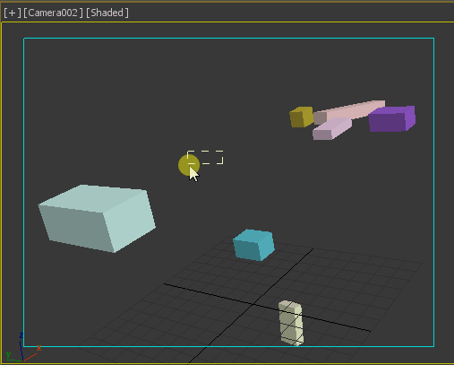

# pX Camera Zoom Extents

The definitive "Zoom Extents selected" that supports 3ds Max cameras. It calls the default "Zoom Extents..." Max action if the active viewport is not a camera... **So you can replace the default keyboard shortcut (Z) with this macro!**

When Zoom extending with Camera, it only takes into account GeometryClass objects. Ignore anything else, like other cameras and lights.

It keeps the FOV and rotation fixed, only moves camera position in space to fit them all.

**Note:** Algorithm is pure Maxscript with vector and matrix math, can be easily ported to other 3D softwares or game engines.