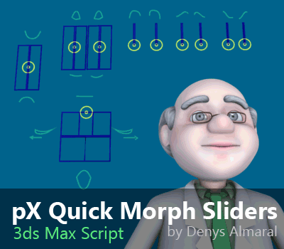

# pxMaxScript
### Time-Saving MaxScript Tools and Tricks – From My Personal Workflow Jungle

A diverse collection of standalone scripts for 3ds Max.  Pick and choose the ones that spark your interest! This repository offers:

Find scripts for specific tasks or workflow improvements. With new tools and updates shared along the way. Browse folders and their readme files to find exactly what you need.

## Featuring

[pxPolyPaint](https://github.com/piXelicidio/pxMaxScript/tree/master/PolyPainter)

Effortlessly apply palette-based texturing by 'painting' polygons directly in the 3ds Max viewport. Ideal for low-poly models and rapid workflows.
***

[pX Quick Morph Sliders](https://github.com/piXelicidio/pxMaxScript/tree/master/MorphSliders)
 
Instantly create shape-slider controls for your morph animations. Skip tedious manual setup.

***
 

[Camera Zoom Extents](https://github.com/piXelicidio/pxMaxScript/tree/master/CameraZoomExtents)

The definitive "Zoom Extents selected" that supports 3ds Max cameras.

