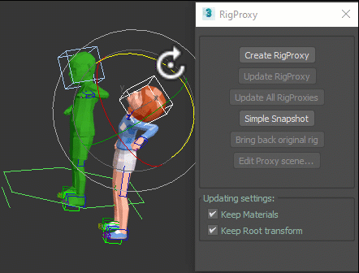

# Rig Proxies (MacroScript)

Creates a snapshot of a rig or hierarchy by saving it as a kind of "proxy" file, keeping the snapshot on the scene.The snapshot keeps only the meshes with all modifiers collapsed. Getting rid of all bones and shapes except the root.
The tool helps you also to edit the proxy file and bring back the updates.
The materials and transformation of the scene snapshot can be preserved when updating from the original rig.

Currently support, Biped or bones with Skin, and most hierarchy of objects.

Instructions: 
- Select the root of the rig and click "Create RigProxy". (The original rig is saved in subfolder .rigproxies)
- "Update RigProxy" merges back any modification done externally to the proxy file. Click while the root if selected.
- "Update All RigProxies" - Not implemented.
- "Simple Snapshot" - Does the Rig snapshot without creating a proxy file.
- "Bring back original rig" - Brings back the original replacing the snapshot created with "Create RigProxy".
- "Edit Proxy scene..." Open the proxy scene file.

