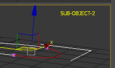

## SubObjectModeViewportLABEL.ms

Display SUB-OBJECT-# in the top right corner of the viewport if we are in any Sub-Object level, or nothing if the current lebel is object. A visual hint if you want to be more aware of the sub-object mode.
